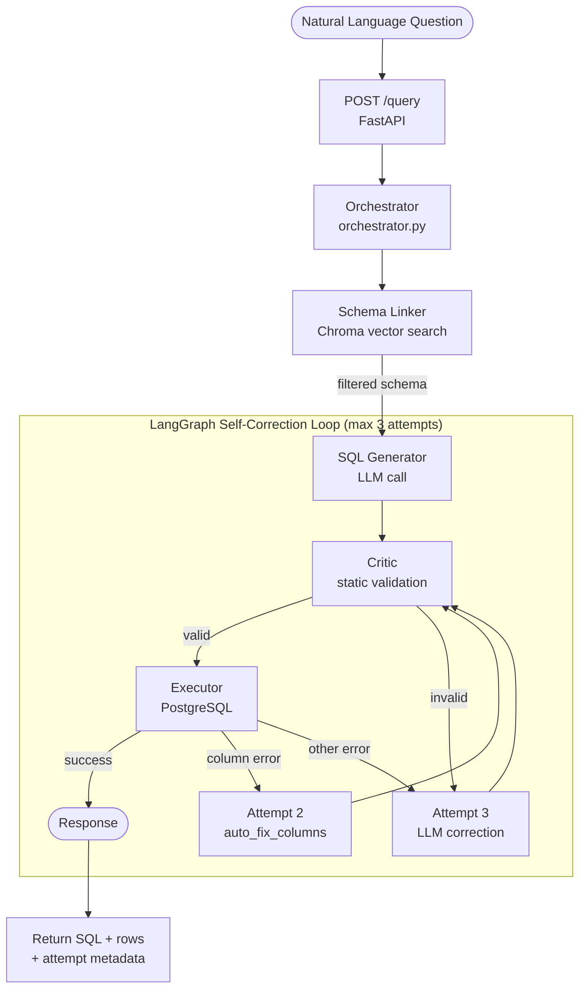

# QueryPilot Architecture

---

## Overview

QueryPilot is a self-correcting Text-to-SQL system built around a structured agent pipeline and a LangGraph state machine. The architecture ensures schema scoping, safe SQL generation, execution validation, and automated correction.

---

## End-to-End Pipeline

```
Question → Schema Linker → SQL Generator → Critic → Executor → Corrector → Response
```

Each stage is modular and independently testable.

---

# Agent Architecture

## 1. Schema Linker

**File**: `backend/app/agents/schema_linker.py`  
**Input**: Question + schema name  
**Output**: Filtered schema dictionary (tables → columns, PK/FK) + list of table names

### How It Works

- Uses `SchemaMetadataExtractor` to pull PostgreSQL metadata (`pg_schema` from schema profile).
- Embeds both tables and columns with `sentence-transformers/all-MiniLM-L6-v2`.
- Stores embeddings in per-schema Chroma collections:
  - `querypilot_ecommerce_v2`
  - `querypilot_library_v2`
  - Includes `schema_name` in metadata.
- For a question:
  - Embeds the text.
  - Queries Chroma with:

    ```python
    where={"schema_name": <schema>}
    ```

  - Retrieves nearest schema chunks.
- Groups hits by `table_name`.
- Expands via foreign keys to pull related tables.

### Why

Strictly scopes downstream LLM to real tables and columns for the selected schema and prevents cross-schema hallucinations.

---

## 2. SQL Generator

**File**: `backend/app/agents/sql_generator.py`  
**Input**: Question + filtered schema + schema name  
**Output**: Raw SQL string

### How It Works

- Builds a prompt containing:
  - `available_tables`
  - Plain-text schema description (columns, PKs, FKs)
- Uses `get_llm()` from `config.py`.
- Calls either:
  - Groq: `llama-3.1-70b-versatile`
  - OpenAI: `gpt-4o-mini`
  - Selected via `LLM_PROVIDER`.
- Enforces strict prompt rules:
  - Use only listed tables
  - No destructive DML
  - Always add `LIMIT`
  - Correct `GROUP BY`

### Why

Generates the initial SQL attempt while guaranteeing it references only allowed tables and columns.

---

## 3. Critic

**File**: `backend/app/agents/critic.py`  
**Input**: Generated SQL + schema context  
**Output**: Validation result (confidence / issues)

### How It Works

- Performs static checks:
  - Blocks keywords like `DROP`, `DELETE`, `ALTER`
- Verifies referenced tables exist in the filtered schema.
- Performs lightweight syntax checks before DB execution.

### Why

Catches unsafe or invalid queries early, saves database round trips, and provides structured error types for correction.

---

## 4. Executor

**File**: `backend/app/agents/executor.py`  
**Input**: Validated SQL  
**Output**: Result rows or structured error

### How It Works

- Builds a SQLAlchemy engine using `db_url` from schema profile.
- Injects `pg_schema` via `search_path` when needed.
- Executes in read-only mode.
- Enforces:
  - `LIMIT`
  - `QUERY_TIMEOUT`
- Normalizes results into `ExecutionResult`:
  - `data`
  - `error_type`
  - `error_message`

### Why

Safely executes SQL against PostgreSQL and abstracts connection pooling and error normalization.

---

## 5. Corrector

**File**: `backend/app/agents/self_correction.py`  
**Input**: Question + current SQL + execution result/error  
**Output**: Corrected SQL or final failure

### How It Works

- Implements a LangGraph state machine (`CorrectionAgent`).
- Orchestrates:

  ```
  SCHEMA_LINK → SQL_GENERATION → CRITIC_VALIDATION → EXECUTION → [SUCCESS | CORRECTION]
  ```

- Uses a **3-attempt strategy** — each attempt has a different correction approach:
  - **Attempt 1**: Fresh SQL generation from the original question.
  - **Attempt 2**: `auto_fix_columns()` — regex + fuzzy-match repair of invalid column references against the filtered schema. No LLM call, fast and cheap.
  - **Attempt 3**: Full LLM correction via `SQLGenerator.generate_with_correction()`, with a correction prompt built from either Critic issues or Executor error feedback.

- Correction prompt (Attempt 3) contains:
  - Failed SQL
  - Error type and database error message
  - Original question
  - Strategy-specific guidance via `CorrectionStrategyRouter` (`backend/app/agents/correction_strategies.py`)

- Tracks:
  - `attempts`
  - `schema_tables_used`
  - `correction_applied` flag
  - Final `error_type` / `error_message`

- Stops after 3 attempts. If still failing, final state has `final_success=False`.
- Includes a **retry guard**: if the generated SQL is identical to the previous attempt (after normalisation), the loop exits early to avoid infinite repetition.
- Non-retryable errors (`permission_denied`, `connection_error`, `unsafe_operation`) exit immediately.

### Why

Enables self-healing SQL generation. The two-stage correction (cheap regex first, LLM second) minimises token usage while recovering most common column-name errors on attempt 2 before spending an LLM call on attempt 3.

---

# LangGraph State Machine

## State Flow

```
SCHEMA_LINKING → SQL_GENERATION → CRITIC_VALIDATION → EXECUTION → [SUCCESS | CORRECTION]
```

**Initial State**:

```
{ question, schema_name }
```

### SCHEMA_LINKING

- Calls `SchemaLinker.link_schema(question)` (the linker is built per-schema, so no schema_name arg is needed at call time)
- Stores:
  - `schema_dict`
  - `schema_tables_used`

### SQL_GENERATION

- Calls `SQLGenerator.generate(question, filtered_schema, schema_name)`

### CRITIC_VALIDATION

- Runs static validation
- Proceeds to:
  - `EXECUTION`
  - or `CORRECTION` if unsafe

### EXECUTION

- Calls `Executor.execute(sql)`
- Stores `ExecutionResult`

### CORRECTION

- If failure and `attempts < 3`, loops back to `SQL_GENERATION` with attempt-specific strategy:
  - Attempt 2 → `auto_fix_columns()` column repair (no LLM)
  - Attempt 3 → LLM correction via `CorrectionStrategyRouter`
- If `attempts == 3` or error is non-retryable, ends with `final_success=False`
- Retry guard: exits early if generated SQL is unchanged from previous attempt

---

# Correction Strategies

**File**: `backend/app/agents/correction_strategies.py`

`CorrectionStrategyRouter` selects the right repair prompt based on the Executor's classified error type:

| Error type | Strategy |
|------------|----------|
| `column_error` | Lists valid columns for the referenced table |
| `aggregation_error` | Reminds generator of GROUP BY rules |
| `timeout_error` | Asks for a more selective query (add WHERE / tighten LIMIT) |
| `generic` / unknown | General "fix the SQL" prompt with full error message |

Critic-blocked queries (never reached the Executor) use `build_critic_correction_prompt()`, which passes the Critic's issue list directly into the correction prompt.

---

# Orchestrator & Agent Caching

**File**: `backend/app/agents/orchestrator.py`

`run_query()` is the single public entrypoint for the pipeline, used by API routes, evaluation scripts, and CLI tools.

## Agent Caching

Agents are expensive to initialise:
- `SchemaLinker` loads the `all-MiniLM-L6-v2` model (~400 ms on cold start).
- `CorrectionAgent` compiles a LangGraph graph.
- `ExecutorAgent` creates a SQLAlchemy connection pool.

The orchestrator caches a fully-built `CorrectionAgent` per schema name in `_agent_cache`. On first request for a schema the cache is populated; all subsequent requests reuse the same instance.

## Known Threading Limitation

`create_self_correction_graph()` writes the four sub-agents to **module-level globals** in `self_correction.py`. Concurrent requests that target **different schemas** may overwrite each other's globals mid-execution. The system is safe for a single-threaded uvicorn dev server but **must not be run with `--workers > 1`** until the graph internals are redesigned to use closures or instance-level state.

---

# Schema Profiles

**Defined in**: `backend/app/schema_profiles.json`  
Loaded by `config.py` at startup.

## Profile Structure

Each entry contains:

- `pg_schema` — PostgreSQL schema name
- `collection_name` — Chroma collection name

Example values:

- `public` (ecommerce)
- `library`
- `querypilot_ecommerce_v2`
- `querypilot_library_v2`

## Runtime Usage

### SchemaLinker

- Uses `collection_name` and `CHROMA_URL`.
- Uses `pg_schema` when extracting PostgreSQL metadata.

### Executor

- Uses `db_url`.
- Injects `pg_schema` into `search_path`.

## Adding a New Schema

1. Add profile entry to `schema_profiles.json`.
2. Run:

   ```bash
   docker-compose exec backend python scripts/setup_schema.py --schema-name <n> --pg-schema <pg_schema>
   ```

3. Redeploy.
4. `startup_index.py` indexes schema into its Chroma collection.

---

# Tech Stack

| Layer | Technology |
|--------|------------|
| API | FastAPI |
| Orchestration | LangGraph (CorrectionAgent graph) |
| LLM | Groq llama-3.1-70b-versatile or OpenAI gpt-4o-mini |
| Embeddings | sentence-transformers/all-MiniLM-L6-v2 |
| Vector DB | ChromaDB |
| SQL DB | PostgreSQL 16 (Neon cloud) |
| Containers | Docker + docker-compose |
| Deployment | Render (free tier) |

---

# High-level Diagram


